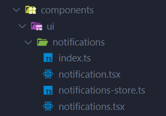
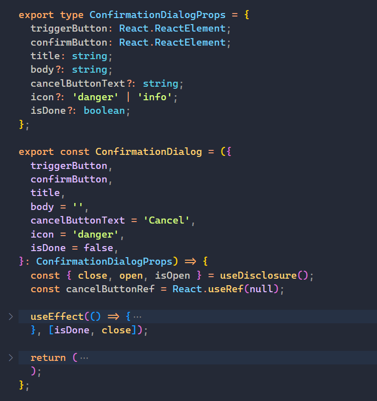

# 🧱 Components And Styling

## Components Best Practices

**Colocate things as close as possible to where it's being used**

Keep components, functions, styles, state, etc. as close as possible to where they are being used. This will not only make your codebase more readable and easier to understand but it will also improve your application performance since it will reduce redundant re-renders on state updates.



### Avoid large components with nested rendering functions

Do not add multiple rendering functions inside your application, this gets out of control pretty quickly. What you should do instead is if there is a piece of UI that can be considered as a unit, is to extract it in a separate component.

```javascript
// this is very difficult to maintain as soon as the component starts growing
function Component() {
  function renderItems() {
    return <ul>...</ul>;
  }
  return <div>{renderItems()}</div>;
}

// extract it in a separate component
function Items() {
  return <ul>...</ul>;
}

function Component() {
  return (
    <div>
      <Items />
    </div>
  );
}
```

#### Stay consistent

Keep your code style consistent. For example, if you name your components using pascal case, do it everywhere. Most of code consistency is achieved by using linters and code formatters, so make sure you have them set up in your project.

#### Limit the number of props a component is accepting as input

If your component is accepting too many props you might consider splitting it into multiple components or use the composition technique via children or slots.



### Component libraries

Every project requires some UI components such as modals, tabs, sidebars, menus, etc. Instead of building those from scratch, you might want to use some of the existing, battle-tested component libraries.

#### Suggested One

- [ShadCn UI](https://ui.shadcn.com/)
  - [Awesome shadcn-ui](https://awesome-shadcn-ui.vercel.app/)
- [Park UI](https://park-ui.com/)

#### Fully featured component libraries

These component libraries come with their components fully styled.

- [Chakra UI](https://chakra-ui.com/) - great library with great developer experience, allows very fast prototyping with decent design defaults. Plenty of components that are very customizable and flexible with accessibility already configured out of the box.

- [MUI](https://mui.com/material-ui/) - the most popular component library for React. Has a lot of different components. Can be used as a styled solution by implementing Material Design or as unstyled headless component library.

#### Headless component libraries

These component libraries come with their components unstyled. If you have a specific design system to implement, it might be easier and better solution to go with headless components that come unstyled than to adapt a fully featured component library such as Material UI to your needs. Some good options are:

- [Radix UI](https://www.radix-ui.com/)
- [Headless UI](https://headlessui.dev/)
- [react-aria](https://react-spectrum.adobe.com/react-aria/)
- [Ark UI](https://ark-ui.com/)
- [Reakit](https://reakit.io/)

### Styling Solutions

There are multiple ways to style a react application. Some good options are:

- [tailwind](https://tailwindcss.com/)
- [vanilla-extract](https://github.com/seek-oss/vanilla-extract)
- [Panda CSS](https://panda-css.com/)
- [emotion](https://emotion.sh/docs/introduction)

#### More Suggestions

- [Awesome React](https://github.com/enaqx/awesome-react)
