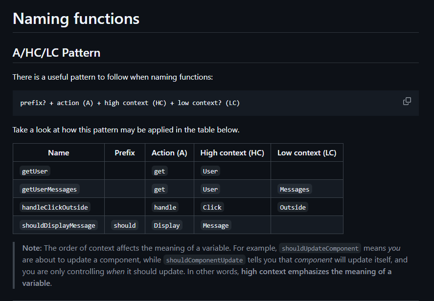

# ⚙️ Project Standards

Enforcing project standards is crucial for maintaining code quality, consistency, and scalability in a React application. By establishing and adhering to a set of best practices, developers can ensure that the codebase remains clean, organized, and easy to maintain.

## ESLint

ESLint serves as a valuable linting tool for JavaScript, helping developers in maintaining code quality and adhering to coding standards. By configuring rules in the `.eslintrc.js` file, ESLint helps identify and prevent common errors, ensuring code correctness and promoting consistency throughout the codebase. This approach not only helps in catching mistakes early but also enforces uniformity in coding practices, thereby enhancing the overall quality and readability of the code.

[ESLint Configuration Example Code](../apps/react-vite/.eslintrc.cjs)

## Prettier

Prettier is a useful tool for maintaining consistent code formatting in your project. By enabling the "format on save" feature in your IDE, code is automatically formatted according to the rules set in the `.prettierrc` configuration file. This practice ensures a uniform code style across your codebase and provides helpful feedback on code issues. If the auto-formatting fails, it signals potential syntax error. Furthermore, Prettier can be integrated with ESLint to handle code formatting tasks alongside enforcing coding standards effectively throughout the development process.

[Prettier Configuration Example Code](../apps/react-vite/.prettierrc)

## TypeScript

ESLint is effective for detecting language-related bugs in JavaScript. However, due to JavaScript's dynamic nature, ESLint may not catch all runtime data issues, especially in complex projects. To address this, TypeScript is recommended. TypeScript is valuable for identifying issues during large refactoring processes that may go unnoticed. When refactoring, prioritize updating type declarations first, then resolving TypeScript errors throughout the project. It's important to note that while TypeScript enhances development confidence by performing type checking at build time, it does not prevent runtime failures. Here is a [great resource on using TypeScript with React](https://react-typescript-cheatsheet.netlify.app/).

### Absolute imports

Absolute imports should always be configured and used because it makes it easier to move files around and avoid messy import paths. Wherever you move the file, all the imports will remain intact.

```jsx
// Without Absolute Import
import Button from "../../../component/ui/button";
```

```jsx
// With Absolute Import
import Button from "@/components/ui/button";
```

Here is how to configure it:

For TypeScript (`tsconfig.json`) projects:

```json
"compilerOptions": {
    "baseUrl": ".",
    "paths": {
      "@/*": ["./src/*"]
    }
  }
```

That means that anything in the `src` folder can be accessed via `@`, e.g some file that lives in `src/components/my-component` can be accessed using `@/components/my-component` instead of `../../../components/my-component`.

### File naming conventions

In React.js projects, using **kebab-case** for file names (e.g., `user-profile.js`) is often preferred over **PascalCase** (e.g., `UserProfile.js`)

#### Why use kebab-case for file naming conventions?

- **Better Readability** – Kebab-case is easier to read, especially for long file names (use-fetch-data.js vs. UseFetchData.js). PascalCase can make non-component files harder to distinguish at a glance.

- **Avoids Case-Sensitivity Issues** – Some file systems (e.g., Linux) are case-sensitive, while others (e.g., Windows, macOS by default) are not. Using PascalCase for everything can lead to import mismatches when switching environments (import UserProfile from './userProfile' might work on Windows but break on Linux).

##### Other Naming Conventions

```jsx
/* Bad */
const page_count = 5;
const shouldUpdate = true;

/* Good */
const pageCount = 5;
const shouldUpdate = true;

/* Good as well */
const page_count = 5;
const should_update = true;
```

#### S-I-D

A name must be short, intuitive and descriptive:

- **Short**. A name must not take long to type and, therefore, remember;
- **Intuitive**. A name must read naturally, as close to the common speech as possible;
- **Descriptive**. A name must reflect what it does/possesses in the most efficient way.

```jsx
/* Bad */
const a = 5; // "a" could mean anything
const isPaginatable = a > 10; // "Paginatable" sounds extremely unnatural
const shouldPaginatize = a > 10; // Made up verbs are so much fun!

/* Good */
const postCount = 5;
const hasPagination = postCount > 10;
const shouldPaginate = postCount > 10; // alternatively
```


