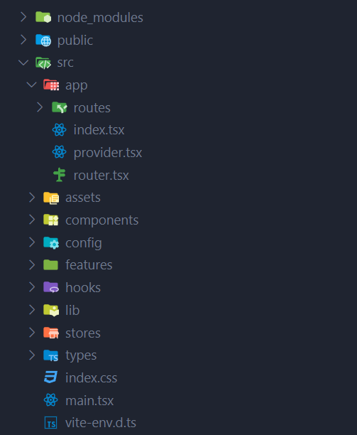
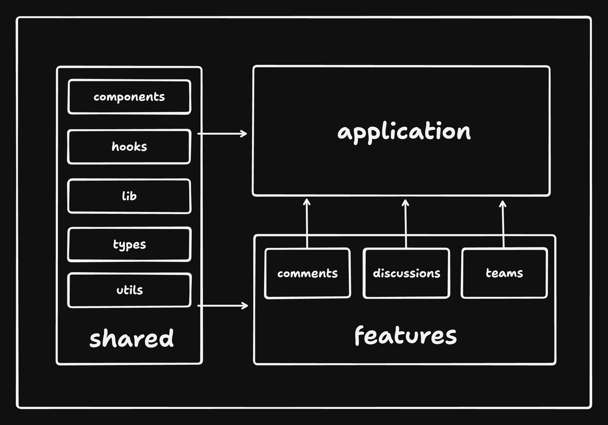

# 🗄️ Project Structure

Most of the code lives in the src folder and looks something like this:



```sh
src
|
+-- app      # application layer containing:
|   +-- routes        # application routes|pages
|   +-- app.tsx       # main application component
|   +-- provider.tsx  # application provider that wraps the entire application with different global providers
|   +-- router.tsx    # application router configuration
+-- assets            # assets folder can contain all the static files such as images, fonts, etc.
|
+-- components        # shared components used across the entire application
|
+-- config            # global configurations, exported env variables etc.
|
+-- features          # feature based modules (optional, for big projects only)
|
+-- hooks             # shared hooks used across the entire application
|
+-- lib               # reusable libraries preconfigured for the application and shared utility functions
|
+-- stores            # global state stores (context API, redux)
|
+-- testing           # test utilities and mocks (not mentioned)
|
+-- types             # shared types used across the application
```

For easy scalability and maintenance, organize most of the code within the features folder. Each feature folder should contain code specific to that feature, keeping things neatly separated. This approach helps prevent mixing feature-related code with shared components, making it simpler to manage and maintain the codebase compared to having many files in a flat folder structure. By adopting this method, you can enhance collaboration, readability, and scalability in the application's architecture.

A feature could have the following structure:

```sh
src/features/awesome-feature
|
+-- api         # exported API request declarations and api hooks related to a specific feature
|
+-- assets      # assets folder can contain all the static files for a specific feature
|
+-- components  # components scoped to a specific feature
|
+-- hooks       # hooks scoped to a specific feature
|
+-- stores      # state stores for a specific feature
|
+-- types       # typescript types used within the feature
|
+-- utils       # utility functions for a specific feature
```

NOTE: You don't need all of these folders for every feature. Only include the ones that are necessary for the feature.

In some cases it might be more practical to keep all API calls outside of the features folders in a dedicated `api` folder where all API calls are defined. This can be useful if you have a lot of shared API calls between features.



By following these practices, you can ensure that your codebase is well-organized, scalable, and maintainable. This will help you and your team to work more efficiently and effectively on the project. This approach can also make it easier to apply similar architecture to apps built with Next.js, Remix or React Native.
